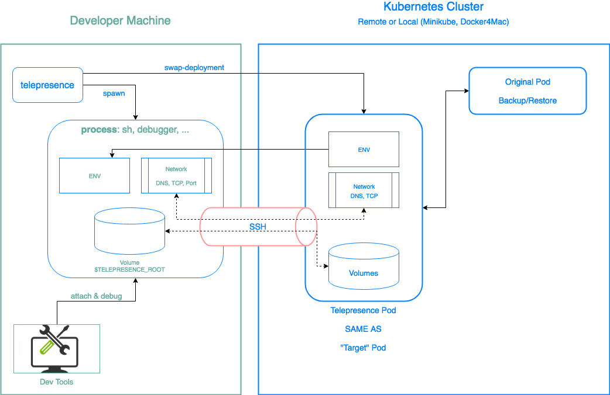

As developers, our development environment is the place where we spend most of our day. We write the code, test it, debug it, and so on. It is very important to have an easy way to set up a development environment. In the monolith era, our lives were simple. Most of the services just required a connection string to the database so we spun up the database and passed the connection to the monolith, that’s it!
Nowadays, we have a production environment with tens and hundreds of services. Those services are interconnected with each other, some of them dependent on other services, some independent. When we need to spin-up an environment on a local machine it can quickly become a mess. So many scripts that we need to run, databases, services, and connect them all together. Sometimes we can find ourselves spending a day just to set up the environment.

Tools like Docker and docker-compose can be very helpful to make this happen. We just need to describe our application in docker-compose.yml file. This is a nice process that makes it easy to set up the environment. We have a full working environment with the network and filesystem setup, all the connections seem to work. We can point to a few cons in that solution. First of all and the most important, the production cluster is not configured with docker-compose ( I really hope so, for your sake ). With the promise of Docker containers to ship the code and the filesystem as one package, we see that the orchestrator is still different. The second reason is that docker-compose works well with 2–5 services, but once you have 15, 25 services with multiple networks and shared filesystems, it becomes much harder, to maintain and hold the load on one machine.

For the case where production is running Kubernetes, we can try and run the same set of Kubernetes manifests yamls on minikube or docker-for-win / docker-for-mac. It makes the maintainability process easier. We are required to maintain a single set of yamls, with some differences between the environments. We can use yaml generation tools to help with that and in Codefresh we use Helm. It solves one of the previous issues that was mentioned earlier. We are still will be running the full development environment on the local machine.

When our application is made of tens and hundreds of microservices, we are required to find new ways to make the development process easier.

# Hybrid model

The hybrid development environment is a model where part of the service is running on the remote cluster and part of it is running on the local machine.
One way to achieve this is to make sure our artifacts, the Docker images, are exposing a debugging port. Also, we need to make sure the cluster exposes that port to the public or private network. Later we can connect to the remote process and start debugging the service. At first glance, this might sound like a good idea but in practice, it has several issues. We now need to include the debugging capabilities on the final artifacts, or, to have another Dockerfile. Also, we need to perform changes in the cluster to expose that port.

## Telepresence

In Codefresh we use Telepresence.
Telepresence is an open-source tool, developed by Datawire and contributed to the CNCF as a sandbox project. It allows connecting to remote Kubernetes clusters and debugging a service remotely. Since the cluster configuration of the remote environment, i.e. the yaml manifests are very similar to the production cluster we get much more confidence in each release.
Running Telepresence is as simple as:  
`telepresence --swap-deployment {YOUR_DEPLOYMENT_NAME}`

Here is an architecture diagram made by Alexei Ledenev (not official).

Let’s take a look at what happens when we run the telepresence command…
* [ Local ] — Running the command (Telepresence will use default kubeconfig file or $KUNECONFIG, and work with the current context. Switch context or specify exactly what context and which namespace to use). Telepresence starts doing 2 things
    * [ REMOTE ] The original deployment is scaled to 0 replicas and a new one deployment is created with 1 replica. This is an identical deployment to the one that was scaled down. The different part is the image, that is now running Telepresence’s image. Once the new deployment is ready, it opens a connection using port-forward to the local machine to forward all the network traffic, and mount the volumes from the cluster to the local file system.
    * [ Local ] On the local machine a new process is spawned as a subprocess of telepresence
The subprocess gets all the environment variables of the deployment, meaning that it knows about all the default Kubernetes variables that are injected to the pod and all the variables from the spec
$TELEPRESENCE_ROOT that indicated where the pod volumes are mounted on the local machine.
* [ Local ] Once the connection is established, we have a new shell and we can start a local process of our service. Since all the environment variables are passed from the deployment, we don’t need any other information. Simply starting the process and will connect it to the remote database and the remote services. All the HTTP requests that are coming to our service will be proxied.
This is a very high-level process overview, you read more about it on the official Telepresence page. It also describes other configuration options that Telepresence supports to forward the traffic and mount the volumes.

Telepresence is not the only solution out there(we just published a post about okteto), and like any other tool it has pros and cons.

### Pros:

* Almost zero configuration. Since all the variables are injected into the new process, most of the time don’t need to change anything.
Exceptions are:
* When the service is looking for a file on the file system. We need to support in code prefix the paths to the files, we have the $TELEPRESENCE_ROOT that points to the location where the remote fs is mounted.
* When running more than one service that is running on the same port, we need to generate ports dynamically and use the flag `--expose LOCAL:REMOTE` to avoid conflicts.
* Production like environments. Our development environment becomes as much as possible close to the production environment (It also is possible to debug the production environment itself, but please don’t do that … )
* We run only one service at the time. Which means that our local machine is not running a heavy load at all.
* We are running the service on the local machine, which means we can use our favorite dev tools.
It helps with onboarding of new team members. When a new developer is joining the team, we don’t need to teach him about a complex development environment. Just to make sure that we have a remote environment configured.

### Cons:
* It seems like magic. I consider it to be both pros and cons, as we need to explain exactly what is going on behind the scenes.
* It requires a stable connection. As all the traffic and the file system are proxied through the SSH tunnel. If the local machine loses the connection we need to manually clean the cluster and the leftovers on the local machine. Of course, it is possible to use Telepresence with the local Kubernetes cluster, but personally, I don’t find it useful.
* Scale. The number of remote environments can grow really quickly as the number of developers grows, which will increase the cost of the cloud.

# Summary
Kubernetes brought a lot of changes to the orchestration world. With the change in the state of mind, we are facing new challenges in the scope of managing the development environment. With the current tools available in the CNCF world we can leverage our remote Kubernetes cluster to make the development process easier, faster, and more reliable. In the next post, we will share our migration process from local environments using docker-compose to Telepresence. We also created some custom tools to make the development experience as smooth as possible.