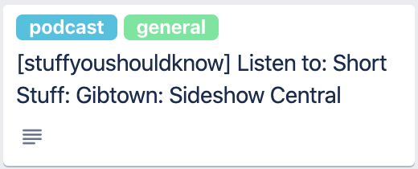

From [whatisrss.com](http://www.whatisrss.com/)
>RSS is a format for delivering regularly changing web content. Many news-related sites, weblogs, and other online publishers syndicate their content as an RSS Feed to whoever wants it.

# TL;DR
[rss-sync](https://github.com/olegsu/rss-sync), is an application I just published that lets you to sync your favorite RSS feeds into your Trello board.
I use it to sync podcast RSS feeds into my Trello list. So each morning I see what podcast I need to listen to catch up. Using the [rss-sync](https://github.com/olegsu/rss-sync) you can customize the card will be created, based on the information from the RSS feed.

# The why
1. It is fun
2. I love automation - read my previous [post](../Continuous-Automation-with-Open-Integration/post.md) about productivity
3. Zapier and other tools are too expensive :-)
4. It is fun, really.

# The use-case
I use RSS feeds to subscribe to podcasts. Of course, I don't manually check the RSS. I tried so many apps over the last two years. Finally, I decided to stay with Spotify. The main reasons were that it has an integration with Google Home, there are mobile and desktop applications, I already use Spotify to listen to music. The only downside in Spotify is that they are not allowed to add manually RSS. It must be done through Spotify platform. I have a few podcasts that are password-protected, which means that to get the RSS I need to "log-in". In the end, I decided that I will not stop using Spotify. I need to get the notifications about the podcasts into one place. All my tasks are managed in one Trello board, both my personal and my professional life on the same board. I decided that once a podcast has an update, I want to get a new ticket into the board and set it in the right list, condition-based.

# Example

In this example, we will sync the podcast show [Stuff You Should Know](https://www.iheart.com/podcast/105-stuff-you-should-know-26940277/) and will create a new Trello card for each show that was published in the last 24 hours.



## Requirements
* Download the binary from [Github](https://github.com/olegsu/rss-sync/releases)
* Trello credentials - you need to get Key and API token from Trello. Go to Trello [Developer API Keys](https://trello.com/app-key). You can find immediately the Key, the token should be generated, follow the steps to generate it.
* Trello board data
    * Board ID - The board ID is part of the URL when you logged in (`https://trello.com/b/BOARD_ID/BOARD_NAME`)
    * List-ID - use the Trello API to get a JSON about your board, inside that you can find the List ID (`https://trello.com/b/{BOARD_ID}.json`). 
    * Labels IDS - Similar to List-ID, but harder to find :-( (not required)
* RSS feed file - copy the content into `feed.yaml`

```yaml
bindings:
- name: stuffyoushouldknow
  rss: stuffyoushouldknow
  target: This Week List

targets:
  - name: This Week List
    trello:
      token: '{{ env.Getenv "TRELLO_TOKEN" }}'
      key: '{{ env.Getenv "TRELLO_KEY" }}'
      board-id: '{{ env.Getenv "TRELLO_BOARD_ID" }}'
      list-id: '{{ env.Getenv "TRELLO_LIST_ID" }}'
      card:
        title: '[{{ .source.name }}] Listen to: {{ .item.title }}'
        description: "{{ .feed.title }}\nLink: {{ .item.link }}\nDescription: {{ .item.description }}"

sources:
- name: stuffyoushouldknow
  rss:
    url: https://feeds.megaphone.fm/stuffyoushouldknow
  filter:
    just-released: '{{ ((time.Now).Add (time.Hour -24)).Before (time.Parse "2006-01-02T15:04:05Z" .item.publishedParsed) }}
```
# The tech

* Using open-integration - read my previous [post](../Continuous-Automation-with-Open-Integration/post.md) about it. What is the architecture, what are the usec-case a more.
* The `feed.yaml` is composition of:   
    * RSS feeds
    * Targets
    * Bindings
* Golang template engine is used here to template the credentials and other values that cannot be published. It uses [gomplate]() to extand the functionality of the basic tempalte library
* Additional datasources that are injected into the template languare are:
    * {{ .item }}
    * {{ .source }}
    * {{ .target }}
    * {{ .binding }}
    * {{ .feed }}


# Conclusion
It seems to me as a nice-to-have tool. Of course, it cannot replace for most of you the automation system like Zapier. I see a few reasons:
* Tools like Zapier are SAAS platform, you pay the price and you don't need to manage anything.
* Tools like Zapier will trigger this flow automatically without you running it.

Disclosure: I work @Codefresh.
I use [Codefresh](https://codefresh.io/), which originally is a CI/CD platform for Kubernetes. Codefresh has a free plan with 1 concurrent pipeline, some limitations on the CPU and memory spec, and the most important, unlimited executions per month. To run the rss-sync, it more than enough. I use the [Cron](https://codefresh.io/docs/docs/configure-ci-cd-pipeline/triggers/cron-triggers/) based trigger of Codefresh to run this process once a day to catch up on all my stuff. 